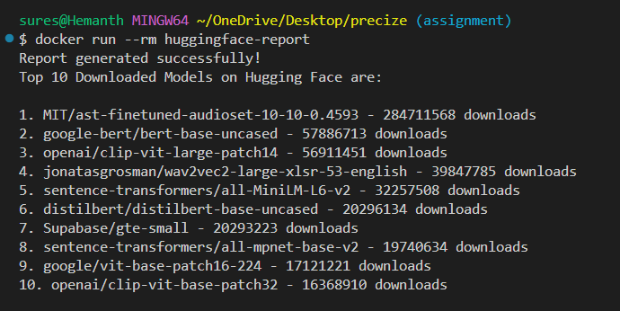

# precizedevops

Docker Commands
    1- Build the image from dockerfile - (docker build -t huggingface-report .)
    2- Run the docker container - (docker run --rm huggingface-report)

The Python Script uses https://huggingface.co/api/models end to fetch the models which was available here https://huggingface.co/docs/hub/en/api, the same script can be utilized to list most liked models with the change of endpoint to https://huggingface.co/api/models?sort=likes
